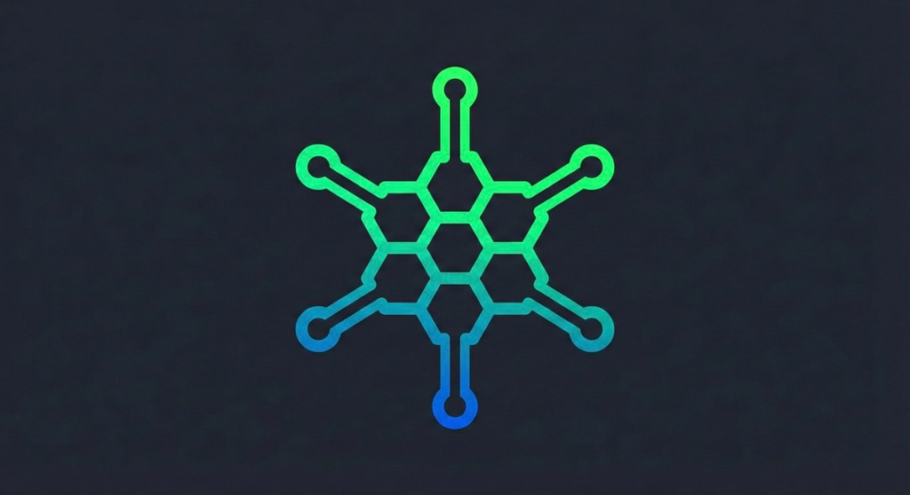

<div align="center">
  
  <h1>Plexus Mesh</h1>
  <p>
    <strong>A Decentralized, Private AI Orchestration Layer</strong>
  </p>
  
  [](https://opensource.org/licenses/MIT)
  [](https://github.com/plexus-mesh/plexus-mesh/actions)
  [](https://github.com/plexus-mesh/plexus-mesh/releases)
  
  <p>
    <a href="#features">Features</a> •
    <a href="#quick-start">Quick Start</a> •
    <a href="#architecture">Architecture</a> •
    <a href="CONTRIBUTING.md">Contribute</a>
  </p>
</div>

---

**Plexus Mesh** allows you to transform your local hardware into a private, high-performance AI powerhouse. Connect devices into a secure P2P grid, share computation, and orchestrate LLMs without relying on centralized APIs.

## 🚀 Features

- **🌐 Decentralized P2P Grid**: Powered by `libp2p`. No central servers. No single point of failure.
- **🧠 Local Intelligence**: Run optimized LLMs (TinyLlama, Phi-2) locally on CPU/GPU via `candle`.
- **🔒 Privacy First**: Your data never leaves your mesh. E2E encrypted communication.
- **⚡ Real-Time Sync**: Live broadcasting of hardware capabilities (CPU/RAM/GPU) via Gossipsub.
- **🎙️ Voice Native**: Integrated Whisper models for low-latency voice control and transcription.

## 📦 Quick Start

### Prerequisites

- **Rust**: v1.75+ (`rustup update stable`)
- **Node.js**: v18+ (for UI)
- **Tauri CLI**: `cargo install tauri-cli`

### Installation

1. **Clone the Repo**

   ```bash
   git clone https://github.com/plexus-mesh/plexus-mesh.git
   cd plexus-mesh
   ```

2. **Run the Main Node (UI + Core)**

   ```bash
   npm install --prefix plexus-ui
   npm run tauri dev --prefix plexus-ui
   ```

3. **Add a Second Worker Node**
   Simulate a cluster by adding a CLI-based worker node:
   ```bash
   cargo run -p plexus-node -- --data-dir tmp/worker-1
   ```

## 🏗️ Architecture

Plexus Mesh uses a modular, event-driven architecture:

| Component         | Description                                                                                 |
| :---------------- | :------------------------------------------------------------------------------------------ |
| **`plexus-core`** | Shared utilities, error types, and tracing infrastructure.                                  |
| **`plexus-p2p`**  | The networking heart. Manages Swarm, Kademlia DHT, and Gossipsub.                           |
| **`plexus-ai`**   | Logic for LLM inference (`candle`), Vector DB connectors (`qdrant`), and Audio (`whisper`). |
| **`plexus-ui`**   | Stunning Glassmorphism interface built with React + Tauri.                                  |

See [ARCHITECTURE.md](./ARCHITECTURE.md) for a deep dive.

## 🤝 Contributing

We welcome contributions! Please see our [CONTRIBUTING.md](./CONTRIBUTING.md) for guidelines on how to submit PRs, report bugs, and suggest features.

## 📜 License

This project is licensed under the [MIT License](./LICENSE).

---

<div align="center">
  <sub>Built with ❤️ by the Plexus Community</sub>
</div>
